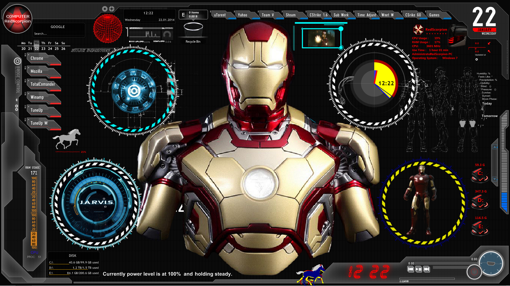

<h1>
  React Robits 
</h1>
A library of sharable React components, by the Frontend Team at Robots & Pencils in an effort to challenge ourselves to think reusable/themeable across client projects, so we can bootstrap development and build off each other.

###### Broken up into two main concepts:

- Core: atomic level components in which a standardized setup can support a majority of the possible use cases
- Periphery: components that are either harder to standarize or have stronger opinions baked in. These are things that may have external dependencies (plugins), or might require different layout structures, making it hard to mandate any one setup cross client or cross use case. So there may end up with multiple variations over time (e.g. - one Upload component built on Dropzone, one on Uppy). For these reasons, these components don't "ship" with the deployed package but are present in the Storybook and accessible directly for manual benefit

## Areas of Focus

Examples of "Core" components:

- Form components
- Buttons
- Generic Modals
- Status indicators (progress bars, loaders)
- UI Elements (badges, tags, pills)
- Generic Cards
- Incremental content (dropdowns, popovers, tooltips)

Examples of "Periphery" components:

- Sliders/Carousels
- Item Tiles
- Video?
- Maps?
- Data Tables?
- Masonry?

###### Component Aspirations

Think reusable. Components should be built with as much abstraction as possible, leaning on optional component properties to govern the rendered output.

Think cross-client/cross-use-case. Try to support as many permutations of the component as possible, which means thinking outside the box in which you're building it. How might others want to leverage this component?

Think customizable. Every component should have an "unstyled" stylesheet that normalizes it and allows for full control. But even within your own theme stylesheet, it's helpful to put major aesthetic tokens as top level sass variables, so that if/when people eject-to-tweak, it quickens their ability to toggle things.

## Directory Structure

```bash
├── src
│   ├── core                    # the library of core files that will be importable into a project
│       ├── components          # core shared components
│       ├── constants           # core shared constants
│       ├── utils               # core shared utility functions
│       ├── styles              # core shared components
│           ├── tokens          # core shared style tokens (sass variables and mixins)
│           ├── themes          # the various themes that can be leveraged
│               ├── unstyled    # the unstyled theme provides no CSS, to make it easier to customize
    ├── periphery               # components outside the core standardized set
│   ├── stories                 # Storybook story files
│       ├── pages               # Supporting files for stories

```

###### In order to properly maintain the library, the follow conventions must be upheld

**File naming and folder structure:**

```bash
├── componentFolderName                               # should exist at the root of /components
│   ├── componentFolderName_{themeName}.module.scss   # theme stylesheets must follow this naming convention
    ├── ComponentFolderName.js                        # the main component of the folder should share the same name
    ├── ComponentFolderNameAddon.js                   # secondary components can exist, but are expected to share the same stylesheet as the main component
```

_Note:_ further folder nesting has not been tested yet.

**ThemeWrapper usage:**
Every component needs to leverage the ThemeWrapper in the following way.
See the [Tech Doc](./TECH.md) for more information.

```js
// in: ComponentName.js
import ThemeWrapper from '../../utils/ThemeWrapper'

export const ComponentName = ({ styling, ...rest }) => (
  <div className={styling.container}>
)

export default ThemeWrapper(themeName => `[componentFolderName]/[componentFolderName]_${themeName}.module.scss`)(ComponentName)
```

**Utility function exports:**

```js
// in: stringUtils.js

const manipulationMethod = str => {
  // ...
}

export default {
  manipulationMethod
}

// this is then used in projects via:
// import { stringUtils } from 'react-robits'
// stringUtils.manipulationMethod()
```

## Contributing

We'll lean on Github Issues and PR's for tracking and managing problems and enhancements, but the higher level branching/merging/publish strategy is still TBD. Reach out to David Fagan if you want to get involved.

### Available Scripts

- `npm run storybook`: runs the Storybook for easy preview, play, and investigation of components
- `npm run build-storybook`: builds a distributable version of Storybook for publishing
- `npm run lint`: runs prettier-standard linting
- `npm run format`: runs the prettier formatting

## Using Robits in Your Project

To pull the library into your project, run the following command line in the root of your project directory:

```
npm install --save git+https://github.com/RobotsAndPencils/react-robits.git#[branch-name-of-desired-theme]
```

_Note_: this package will need reinstalled to grab updates. To do so, it's recommended to set up a shortcut script in your project's `package.json` for ease-of-use:

```
  "install-robits": "npm i --save git+https://github.com/RobotsAndPencils/react-robits.git#[branch-name-of-desired-theme]"
```

There are a few key pieces to include in your project's webpack config.

- Point a Sass Resources Loader configuration to the files contained within the design system package's `./shared/styles` directory. Order matters here, so make sure to include the design system directory before the project directory, if it also relies on this tool

```js
{
    loader: 'sass-resources-loader',
    options: {
        resources: [
          ...project tokens...
          `${path.resolve(
            __dirname,
            'node_modules/react-robits/src/core/styles/tokens'
          )}/**/*.scss`,
          path.resolve(
            __dirname,
            'node_modules/react-robits/src/core/styles/themes/talentPortal/tokens.scss'
          )
          ...additional project overrides as needed...
        ] // the ordering here is important, just like normal SCSS
    }
}
```

_Note_: project level mixins, if they have the exact same name, will override design system level mixins. This is both something to be careful about and a lever you can pull to create project level customizations

You will also then need to make sure your project level webpack properly tranpiles the components being pulled in. Many external libraries come pre-transpiled, but for this, the approach is to defer to project level babel configurations.

So to make sure `babel` runs against the components being imported from React Robits, you'll need to augment or add loader configurations to your webpack like either of the following:

```
{
  test: /\.(js|jsx)$/,
  include: `${path.resolve(__dirname, 'node_modules/react-robits')}`,
  loader: 'babel-loader'
}
```

or

```
{
  test: /\.(js|jsx)$/,
  exclude: /node_modules\/(?!react-robits)/,
  use: 'babel-loader'
}
```

## Ejecting Robits

Ejecting Robits is lever designed to either a) give you full control over the code for customizations, and/or b) decouple from the library to elimintate the dependency. This could be done at the very beginning of the project, as an initial bootstrap, or at the final stage of a project, after having been wired in for the entirety of development, to avoid giving the magic trick away to a client.

The net result is that the files from this library will be copied over to your project, effectively transferring ownership, and erase any notion of the `react-robit` as a dependent package.

To do this, run:

```
node ./node_modules/react-robits/ejectionScripts/eject
```

from the root of your project, and it would cycle through a set of Node scripts to break the ball-and-chain.

For more information, see the [Tech Doc](./TECH.md)

## Storybook Deployment

This is currently deployed to Heroku on a free tier. To deploy from your terminal, you'll need the [Heroku CLI](https://devcenter.heroku.com/articles/heroku-cli#download-and-install) installed and logged in to your Heroku account.

Add Heroku git remote if you haven't already:

```
$ heroku git:remote --app react-robits
$ git remote -v # List available remotes
```

First, from the root of your project folder, run `npm run build-storybook` to compile the distributable package from the branch you wish to deploy.

Then, run one of the following commands...

If you are deploying the `master` branch, run:

```
$ git push heroku master
```

Deploy changes from a branch besides `master`, such as `testbranch`:

```
$ git push heroku testbranch:master
```

Launch Heroku app in browser:

```
$ heroku open --app react-robits
```

Or visit https://react-robits.herokuapp.com

## Media

Check out the [Blog Post](https://robotsandpencils.blogin.co/show-category.php?id=26583) for a detailed article of the thought process and journey to this repo
